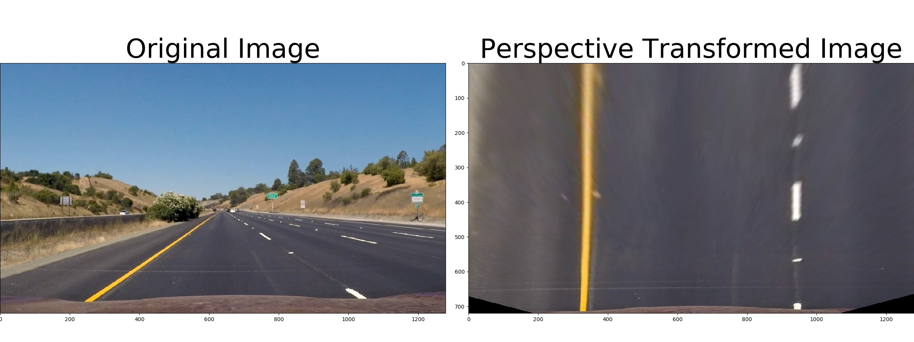

## Writeup

---

**Advanced Lane Finding Project**

The goals / steps of this project are the following:

* Compute the camera calibration matrix and distortion coefficients given a set of chessboard images.
* Apply a distortion correction to raw images.
* Use color transforms, gradients, etc., to create a thresholded binary image.
* Apply a perspective transform to rectify binary image ("birds-eye view").
* Detect lane pixels and fit to find the lane boundary.
* Determine the curvature of the lane and vehicle position with respect to center.
* Warp the detected lane boundaries back onto the original image.
* Output visual display of the lane boundaries and numerical estimation of lane curvature and vehicle position.

[//]: # (Image References)

[image1]: ./examples/undistort_output.png "Undistorted"
[image2]: ./test_images/test1.jpg "Road Transformed"
[image3]: ./examples/binary_combo_example.jpg "Binary Example"
[image4]: ./examples/warped_straight_lines.jpg "Warp Example"
[image5]: ./examples/color_fit_lines.jpg "Fit Visual"
[image6]: ./examples/example_output.jpg "Output"
[video1]: ./project_video.mp4 "Video"

## [Rubric](https://review.udacity.com/#!/rubrics/571/view) Points

### Here I will consider the rubric points individually and describe how I addressed each point in my implementation.  

---
### Camera Calibration

#### 1. Use 9X6 cheese board images in folder `camera_cal` to calibrate cameras

The code for this step is contained python file "./src/cameraCalibration.py". 

I start by preparing "object points", which will be the (x, y, z) coordinates of the chessboard corners in the world. Here I am assuming the chessboard is fixed on the (x, y) plane at z=0, such that the object points are the same for each calibration image.  Thus, `objp` is just a replicated array of coordinates, and `objpoints` will be appended with a copy of it every time I successfully detect all chessboard corners in a test image.  `imgpoints` will be appended with the (x, y) pixel position of each of the corners in the image plane with each successful chessboard detection.  

I then used the output `objpoints` and `imgpoints` to compute the camera calibration and distortion coefficients using the `cv2.calibrateCamera()` function.  I applied this distortion correction to the test image using the `cv2.undistort()` function and obtained this result: 


### Pipeline (single images)

#### 1. Provide an example of a distortion-corrected image.

use the `mtx` and `dist` parameter calculated in python file "./src/cameraCalibration.py" to get the undist image per
`cv2.undistort(img, mtx, dist, None, mtx)`


#### 2. Use HSL color space, Sobel gradient operation to get a binary lane line image
I used a combination of color and gradient thresholds to generate a binary image. The corresponding parameters are shown as below:
```python
    hlsFiltered = hls_select(undist, thresh_s=(90, 255), thresh_l=(30, 255))

    # Choose a Sobel kernel size
    ksize = 3  # Choose a larger odd number to smooth gradient measurements

    # Apply each of the thresholding functions
    gradx = abs_sobel_thresh(image, orient='x', sobel_kernel=ksize, thresh=(10, 180))
    grady = abs_sobel_thresh(image, orient='y', sobel_kernel=ksize, thresh=(15, 160))
    mag_binary = mag_thresh(image, sobel_kernel=ksize, mag_thresh=(50, 160))
    dir_binary = dir_threshold(image, sobel_kernel=ksize, thresh=(0.7, 1.3))
```


and their combination binary image:
```python    
    combined = np.zeros_like(dir_binary)
    combined[((gradx == 1) & (grady == 1)) | ((mag_binary == 1) & (dir_binary == 1)) | (hlsFiltered == 1)] = 1
```


then get region of interest:
```python
   # region of interest
    imshape = image.shape
    left_bottom = (120,imshape[0])
    left_top = (int(imshape[1]*0.45), int(imshape[0]*0.6))
    right_top = (int(imshape[1]*0.55), int(imshape[0]*0.6))
    right_bottom = (imshape[1]-50,imshape[0])
    vertices = np.array([[left_bottom,left_top, right_top, right_bottom]], dtype=np.int32)
    masked_combined = roi(combined,vertices)
```
  


#### 3. perform a perspective transform.

The code for my perspective transform includes a function called `warper()`, which appears in lines 1 through 8 in the file `example.py` (output_images/examples/example.py) (or, for example, in the 3rd code cell of the IPython notebook).  The `warper()` function takes as inputs an image (`img`), as well as source (`src`) and destination (`dst`) points.  I chose the hardcode the source and destination points in the following manner:

```python
src = np.float32(
    [[(img_size[0] / 2) - 55, img_size[1] / 2 + 100],
    [((img_size[0] / 6) - 10), img_size[1]],
    [(img_size[0] * 5 / 6) + 60, img_size[1]],
    [(img_size[0] / 2 + 55), img_size[1] / 2 + 100]])
dst = np.float32(
    [[(img_size[0] / 4), 0],
    [(img_size[0] / 4), img_size[1]],
    [(img_size[0] * 3 / 4), img_size[1]],
    [(img_size[0] * 3 / 4), 0]])
```

This resulted in the following source and destination points:

| Source        | Destination   | 
|:-------------:|:-------------:| 
| 585, 460      | 320, 0        | 
| 203, 720      | 320, 720      |
| 1127, 720     | 960, 720      |
| 695, 460      | 960, 0        |

I verified that my perspective transform was working as expected by drawing the `src` and `dst` points onto a test image and its warped counterpart to verify that the lines appear parallel in the warped image.



#### 4. identify lane-line pixels and fit their positions with a polynomial

- First search lane line pixel per sliding window for the first search by using function `find_lane_pixels(binary_warped)` in file `./src/cameraCalibration.py`

- Second search lane line pixel per searching around fitted lane line by using function `search_around_poly(binary_warped,left_fit, right_fit)` in file `./src/cameraCalibration.py`

- Fit lane line poly by:
```python
def fit_poly(img_shape, leftx, lefty, rightx, righty):
    ### TO-DO: Fit a second order polynomial to each with np.polyfit() ###
    left_fit = np.polyfit(lefty, leftx, 2)
    right_fit = np.polyfit(righty, rightx, 2)
    # Generate x and y values for plotting
    ploty = np.linspace(0, img_shape[0] - 1, img_shape[0])
    ### TO-DO: Calc both polynomials using ploty, left_fit and right_fit ###
    left_fitx = left_fit[0] * ploty ** 2 + left_fit[1] * ploty + left_fit[2]
    right_fitx = right_fit[0] * ploty ** 2 + right_fit[1] * ploty + right_fit[2]

    return left_fitx, right_fitx, ploty
```

#### 5. Calculate the radius of curvature of the lane and the position of the vehicle with respect to center.

I did this in `./src/cameraCalibration.py` by using function ` measure_curv(leftx, lefty, rightx, righty, ym_per_pix=30 / 720, xm_per_pix=3.7 / 700)` and `measure_offset(leftx, lefty, rightx, righty, ym_per_pix=30 / 720, xm_per_pix=3.7 / 700)`

#### 6. result plotted back down onto the road such that the lane area is identified clearly.

I implemented this step in `./src/cameraCalibration.py` in the function `DrawLine(original_image, binary_warped, Minv, left_fit, right_fit)`.  Here is an example of my result on a test image:


---

### Pipeline (video)

#### 1. Create a image processing pipeline in file `src/imagePipeline.py` and then do videoProcessing in file `src/videoProcessing.py`
Here's a [link to my video result](./output_video/project_video.mp4)

---

### Discussion

#### 1. Briefly discuss any problems / issues you faced in your implementation of this project.  Where will your pipeline likely fail?  What could you do to make it more robust?

The lane detection will have noise when road boundary are detected, region of interest can filter out most of the noise. 